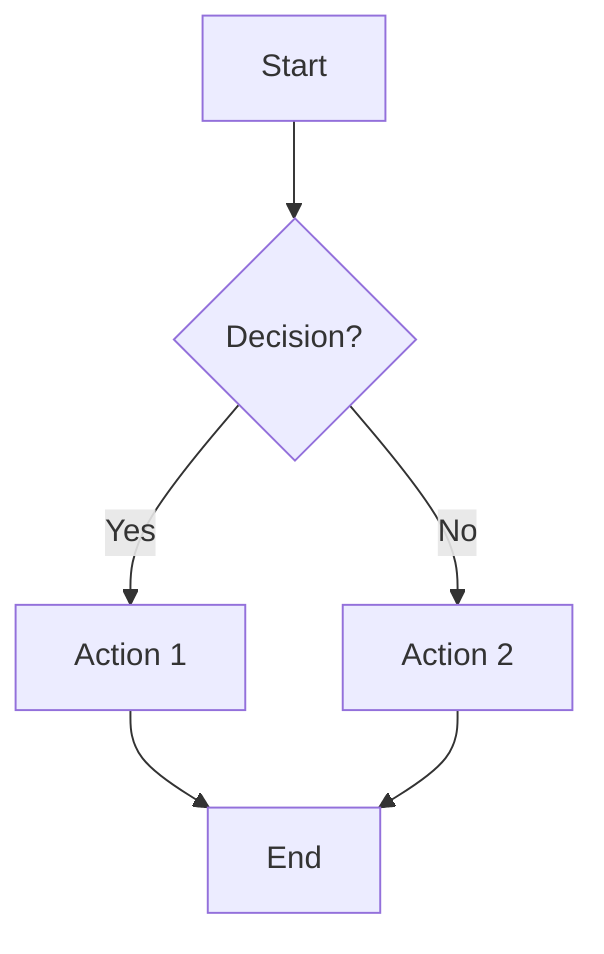
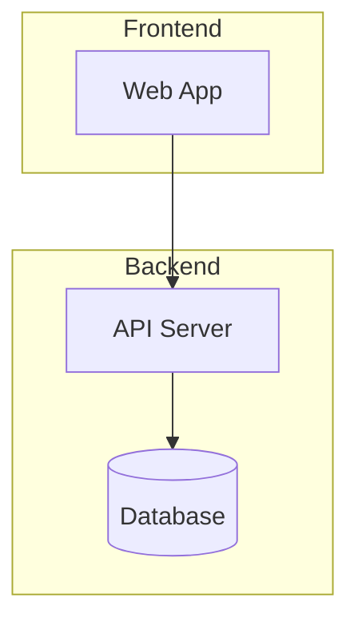
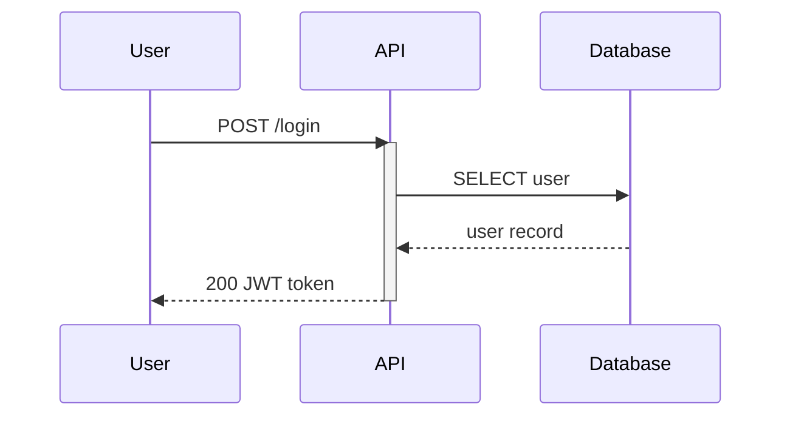
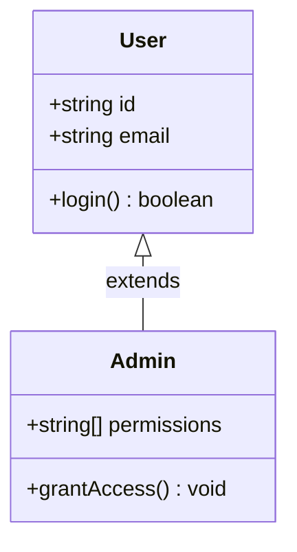
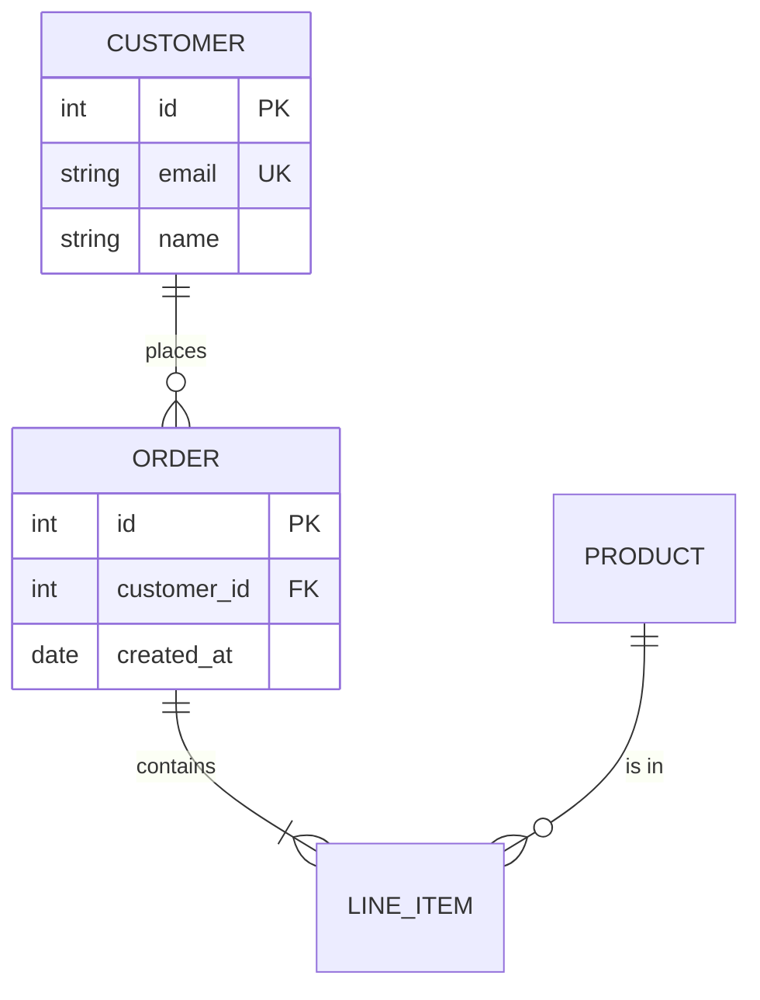
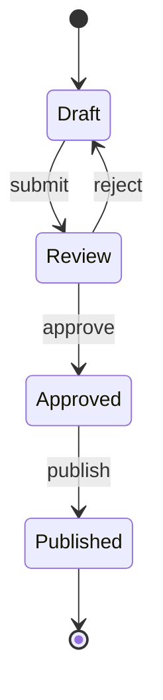
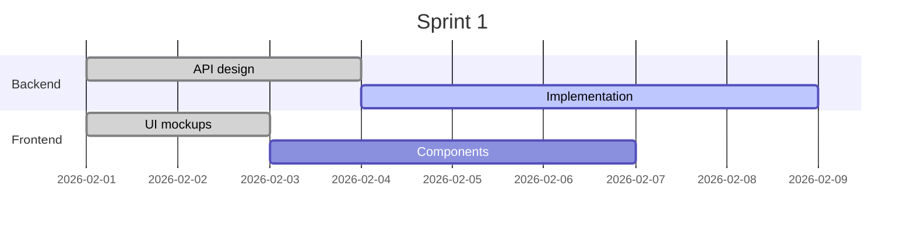
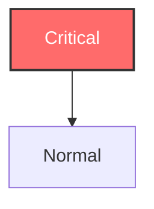
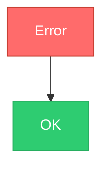

# Mermaid Diagrams

Generate correct, readable Mermaid diagrams. This skill exists because LLMs frequently produce broken Mermaid syntax — syntax matters, and small errors cause silent failures or parse errors.

<HARD-GATE>
**Always validate before delivering.** Never return a Mermaid diagram to the user without confirming it parses successfully. Use the validation step below.
</HARD-GATE>

## When to Use

- Creating any Mermaid diagram (flowchart, sequence, class, ERD, etc.)
- Documenting architecture, data flow, or processes
- Adding diagrams to design docs, PRs, or README files
- Converting visual diagrams to Mermaid code

## Validation (Required)

After generating any diagram, validate it before presenting:

```bash
# Install mermaid CLI if needed
npx -p @mermaid-js/mermaid-cli mmdc -i input.mmd -o output.png -s 3
```

If it fails:
1. Read the error message — it includes line number and expected token
2. Fix the specific syntax error
3. Re-validate
4. Repeat until clean

**Do not skip this step.** LLMs are overconfident about Mermaid syntax. Validation catches errors the model doesn't notice.

## Common LLM Errors

These are the errors LLMs make most often. Check for them before validating:

| Error | Example | Fix |
|-------|---------|-----|
| **Bare `end` keyword** | `end` as a node name | Use `End`, `END`, or `["end"]` |
| **Unquoted special chars** | `A(text with (parens))` | `A["text with (parens)"]` |
| **Wrong arrow syntax** | `A -> B` (flowchart) | `A --> B` |
| **Missing diagram type** | Starting with nodes directly | Always start with `flowchart TD` or similar |
| **Leading `o` or `x` in node ID** | `output --> next` | Creates circle/cross edge — rename to `outputNode` |
| **Incorrect classDef for diagram type** | classDef in sequence diagram | classDef only works in flowcharts |
| **Wrong relationship syntax** | ERD using `-->` instead of `\|\|--o{` | Each diagram type has its own link syntax |
| **Semicolons in labels** | `A[step 1; step 2]` | Use `#59;` entity or split nodes |
| **Broken subgraph** | Missing `end` to close subgraph | Every `subgraph` needs a matching `end` |

## Diagram Types Reference

### Flowchart

The most common type. Use for processes, workflows, decision trees.



**Direction keywords:** `TD` (top-down), `LR` (left-right), `BT` (bottom-up), `RL` (right-left)

**Node shapes:**
| Shape | Syntax | Use For |
|-------|--------|---------|
| Rectangle | `A[text]` | Process steps |
| Rounded | `A(text)` | Start/end |
| Stadium | `A([text])` | Terminal |
| Diamond | `A{text}` | Decision |
| Circle | `A((text))` | Connector |
| Hexagon | `A{{text}}` | Preparation |
| Cylinder | `A[(text)]` | Database |
| Subroutine | `A[[text]]` | Subprocess |
| Parallelogram | `A[/text/]` | Input/output |
| Double circle | `A(((text)))` | Double connector |

**Link types:**
| Link | Syntax |
|------|--------|
| Arrow | `A --> B` |
| Open | `A --- B` |
| Dotted arrow | `A -.-> B` |
| Thick arrow | `A ==> B` |
| With label | `A -->\|label\| B` |
| Bidirectional | `A <--> B` |
| Invisible | `A ~~~ B` |

**Subgraphs:**


### Sequence Diagram

Use for API interactions, message flow between components.



**Arrow types:**
| Arrow | Syntax | Meaning |
|-------|--------|---------|
| Solid line | `->>` | Synchronous call |
| Dotted line | `-->>` | Response/return |
| Solid (no arrow) | `->` | Async message |
| Dotted (no arrow) | `-->` | Async response |
| Cross | `-x` | Lost message |

**Tips:**
- Limit to 5-7 participants
- Use `activate`/`deactivate` for request scope
- Use `Note over A,B: text` for annotations
- Use `alt`/`else`/`end` for conditionals
- Use `loop`/`end` for repetition

### Class Diagram

Use for type hierarchies, interface relationships, data models.



**Relationships:**
| Relationship | Syntax |
|-------------|--------|
| Inheritance | `A <\|-- B` |
| Composition | `A *-- B` |
| Aggregation | `A o-- B` |
| Association | `A --> B` |
| Dependency | `A ..> B` |
| Realization | `A ..\|> B` |

### Entity Relationship Diagram

Use for database schema documentation.



**Cardinality:**
| Symbol | Meaning |
|--------|---------|
| `\|\|` | Exactly one |
| `o\|` | Zero or one |
| `}o` | Zero or many |
| `}\|` | One or many |

### State Diagram

Use for state machines, workflow states, lifecycle diagrams.



### Gantt Chart

Use for project timelines, sprint planning.



### Other Diagram Types

| Type | Declaration | Best For |
|------|------------|----------|
| Pie | `pie` | Proportions |
| Mindmap | `mindmap` | Brainstorming, hierarchies |
| Timeline | `timeline` | Chronological events |
| Git graph | `gitgraph` | Branch strategy |
| C4 | `C4Context` | Architecture (system context) |
| Quadrant | `quadrant-beta` | Priority matrices |
| Sankey | `sankey-beta` | Flow quantities |
| Architecture | `architecture-beta` | Cloud/system architecture |

## Styling

### Inline Styles



### Class-Based Styles (Preferred)



### Theme Configuration

Use frontmatter at the top of the diagram:
```
---
config:
  theme: dark
  look: classic
---
flowchart TD
    A --> B
```

Available themes: `default`, `dark`, `forest`, `neutral`

## Readability Rules

1. **Keep under 30 nodes.** Split larger diagrams into multiple focused diagrams.
2. **Use meaningful IDs.** `userService --> database` not `A --> B`.
3. **Label relationships.** `A -->|creates| B` not just `A --> B`.
4. **Choose direction wisely.** `TD` for hierarchies, `LR` for sequences/flows.
5. **Group related nodes.** Use subgraphs with descriptive titles.
6. **One concept per diagram.** A sequence diagram AND a class diagram, not both crammed into one flowchart.

## Special Characters

Mermaid's parser is fragile with special characters. Always handle them:

| Character | Problem | Solution |
|-----------|---------|----------|
| `(` `)` | Breaks node syntax | Wrap label in quotes: `A["text (with parens)"]` |
| `#` | Interpreted as entity | Use `#35;` |
| `;` | Line terminator | Use `#59;` |
| `"` inside labels | Breaks quotes | Use `#quot;` or restructure |
| `end` (lowercase) | Closes subgraph/block | Use `End`, `END`, or `["end"]` |
| `<` `>` | HTML interpretation | Use `#lt;` and `#gt;` |

**When in doubt, wrap the label in double quotes:** `A["Any tricky text here"]`

## Process: Generating a Diagram

1. **Choose the right diagram type.** Flowchart for processes, sequence for interactions, ERD for schemas, class for types.
2. **Start with structure.** Define nodes and relationships before adding styling.
3. **Keep it simple.** Start with the essential paths. Add detail incrementally.
4. **Quote all labels.** `A["Label text"]` is always safer than `A[Label text]`.
5. **Validate.** Run through mermaid-cli. Fix any parse errors.
6. **Review visually.** Check that the layout is readable and relationships are clear.

## Repair Pattern

When validation fails:

```
Generate diagram → Validate → Parse error?
                                ↓ yes
                   Read error (line + expected token)
                                ↓
                   Fix that specific line
                                ↓
                   Re-validate → still failing?
                                ↓ yes
                   Try different approach (simplify, restructure)
                                ↓
                   Re-validate → clean ✓
```

**Max 3 repair attempts.** If a diagram won't parse after 3 fixes, simplify it — remove complexity until it works, then add back incrementally.

## Guidelines

- **Validate every diagram.** No exceptions. LLMs are unreliable with Mermaid syntax.
- **Quote labels by default.** `A["Label"]` prevents most parsing issues.
- **One diagram type per block.** Don't mix flowchart and sequence syntax.
- **Prefer `flowchart` over `graph`.** `flowchart` is the modern syntax with more features.
- **Keep it readable in source.** The markdown source should be scannable — use consistent indentation and spacing.
- **Split large diagrams.** Three focused diagrams beat one overwhelming diagram.
- **Direction matches content.** Top-down for hierarchies and processes. Left-right for timelines and sequences.
- **Style sparingly.** One or two highlight colors, not a rainbow. Use classDef for consistency.
